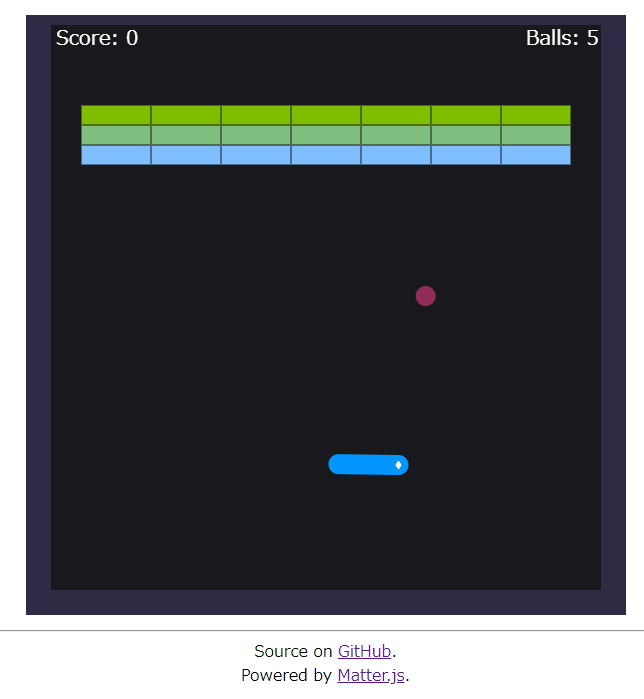

BreakOutArch
============

A breakout game clone with arching trajectory

Try it now on your browser!

http://msakuta.github.io/breakout-arch/index.html

Gameplay
--------

You control the paddle at the bottom with a mouse.

Move the paddle (which can rotate like a rigid body) to deflect the ball against
the blocks.
Hitting a block will score 10 points.

If you drop the ball 5 times, the game is over.

Libraries
---------

This project uses [matter.js](https://github.com/liabru/matter-js).
